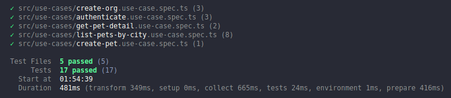
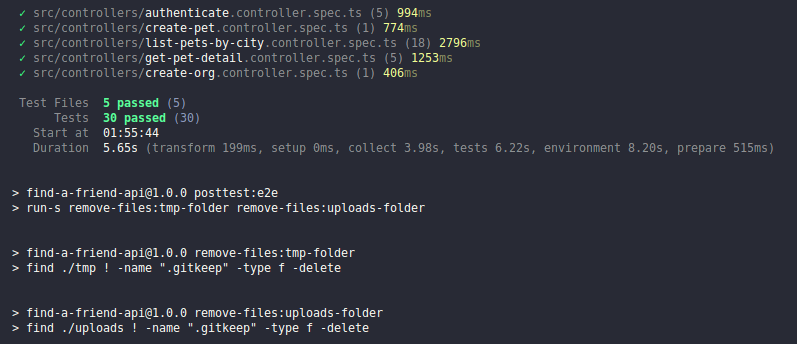

# 🐾 Find A Friend API

<p align="center">
  
  
  
  
  
  
  
</p>

Bem-vindo ao Find a Friend - um projeto desenvolvido para ajudar pessoas a encontrar o seu amigo de quatro patas! Este site tem como objetivo facilitar o processo de adoção de animais de estimação, permitindo que os usuários encontrem cães e gatos disponíveis para adoção em sua cidade/estado ou que atendam às suas preferências em termos de idade, energia, independência e tamanho.

Com o Find a Friend, você pode procurar por animais de estimação que se adequem ao seu estilo de vida e ao seu ambiente doméstico, para garantir que você e seu novo amigo tenham a melhor experiência possível. Além disso, nosso site é atualizado constantemente com novos animais disponíveis para adoção, para que você possa encontrar o seu companheiro perfeito.

Não hesite em usar nossos filtros de pesquisa para encontrar um animal de estimação que se encaixe nas suas necessidades e desejos. Estamos aqui para ajudá-lo em cada passo do caminho, para garantir que você encontre um amigo que trará muita alegria e amor para sua vida. Obrigado por escolher o Find a Friend para ajudá-lo nesta jornada de adoção!

## 🧭 Como rodar o projeto

### Pré-requisitos

- É necessário ter docker para criação do container do banco de dados
- É necessário ter conta no [Supabase](https://app.supabase.com/sign-in) e possuir bucket configurado

**Clone o repositório**

```bash
git clone https://github.com/vitorsemidio-dev/find-a-friend-api.git
```

**Instale as dependências**

```bash
npm install
```

**Copie as variáveis de ambiente**

```bash
cp .env.exemple .env
```

**Execute o banco de dados com docker**

```bash
docker-compose up -d
```

**Execute as migrations**

```bash
npx prisma migrate dev
```

**Inicie a aplicação**

```bash
npm run start:dev
```

## Funcionalidades e regras da aplicação

### Regras da aplicação

- [x] Deve ser possível cadastrar um pet
- [x] Deve ser possível listar todos os pets disponíveis para adoção em uma cidade
- [x] Deve ser possível filtrar pets por suas características
- [x] Deve ser possível visualizar detalhes de um pet para adoção
- [x] Deve ser possível se cadastrar como uma ORG
- [x] Deve ser possível realizar login como uma ORG

### Regras de negócio

- [x] Para listar os pets, obrigatoriamente precisamos informar a cidade
- [x] Uma ORG precisa ter um endereço e um número de WhatsApp
- [x] Um pet deve estar ligado a uma ORG
- [x] O usuário que quer adotar, entrará em contato com a ORG via WhatsApp
- [x] Todos os filtros, além da cidade, são opcionais
- [x] Para uma ORG acessar a aplicação como admin, ela precisa estar logada

### Requisitos não-funcionais

- [x] Salvar imagens dos pets no Supabase
- [x] Salvar dados no banco de dados PostgreSQL

## Tabelas


## Layout

Clique no link para acessar o layout no Figma: [clique aqui](https://www.figma.com/community/file/1220006040435238030)

<a href="https://www.figma.com/community/file/1220006040435238030" target="_blank">
  
</a>

## Testes

**Testes unitários**

```bash
npm run test:unit
```



**Testes e2e**

```bash
npm run test:e2e
```


