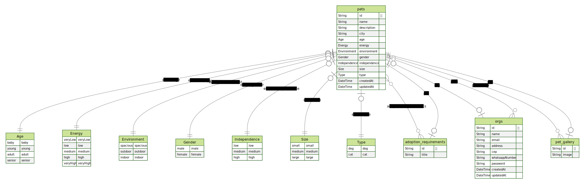

# Find A Friend API

Nesse desafio desenvolveremos uma API para a adoção de animais, a FindAFriend API, utilizando SOLID e testes.

### Regras da aplicação

- [x] Deve ser possível cadastrar um pet
- [x] Deve ser possível listar todos os pets disponíveis para adoção em uma cidade
- [x] Deve ser possível filtrar pets por suas características
- [x] Deve ser possível visualizar detalhes de um pet para adoção
- [x] Deve ser possível se cadastrar como uma ORG
- [x] Deve ser possível realizar login como uma ORG

### Regras de negócio

- [x] Para listar os pets, obrigatoriamente precisamos informar a cidade
- [x] Uma ORG precisa ter um endereço e um número de WhatsApp
- [x] Um pet deve estar ligado a uma ORG
- [x] O usuário que quer adotar, entrará em contato com a ORG via WhatsApp
- [x] Todos os filtros, além da cidade, são opcionais
- [x] Para uma ORG acessar a aplicação como admin, ela precisa estar logada

### Requisitos não-funcionais

- [x] Salvar imagens dos pets no Supabase
- [x] Salvar dados no banco de dados PostgreSQL

## Tabelas

## Layout

Clique no link para acessar o layout no Figma: [clique aqui](https://www.figma.com/community/file/1220006040435238030)

